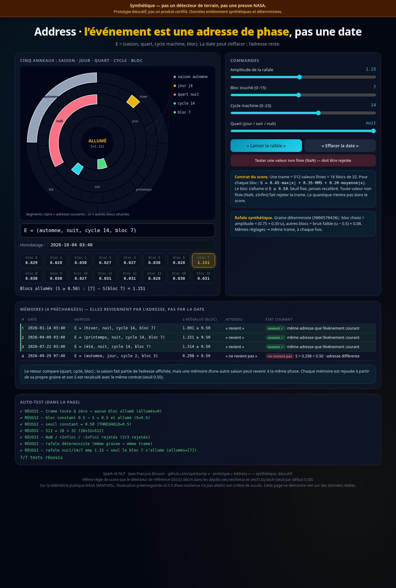
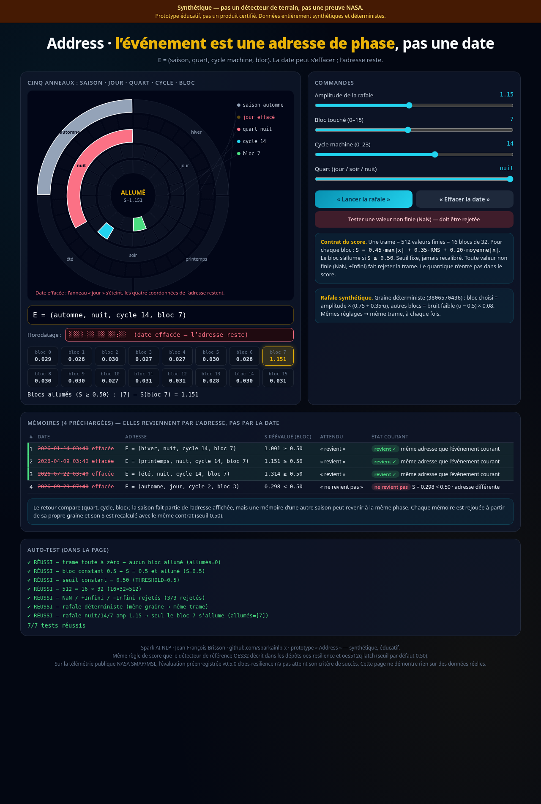

# Address · adresse de phase (prototype éducatif)

**Un événement est une adresse de phase, pas une date.** `E = (saison, quart, cycle machine, bloc)`. La date peut s’effacer ; l’adresse reste.

[](https://github.com/sparkainlp-x/address-phase-demo/actions/workflows/ci.yml)
[](https://doi.org/10.5281/zenodo.23129671)
[](LICENSE)
[](#ce-que-ce-nest-pas)
[](#ce-que-ce-nest-pas)

Une seule page HTML autonome ([`Address.html`](Address.html)) : aucun CDN, aucune police externe, aucune requête réseau, aucun hébergement. Spark AI NLP · Jean-François Brisson.

> **Synthétique — pas un détecteur de terrain, pas une preuve NASA.**
> Prototype éducatif, pas un produit certifié. Ce dépôt n’est pas une subvention.



## Ce que c’est

- **Une démonstration pédagogique.** Cinq anneaux concentriques (saison, jour, quart, cycle, bloc) montrent l’adresse courante. Des curseurs règlent l’amplitude, le bloc (0–15), le cycle machine (0–23) et le quart (jour / soir / nuit).
- **« Lancer la rafale »** génère une trame synthétique **déterministe** (graine dérivée des réglages) : une rafale dans le bloc choisi, un bruit faible ailleurs. La page calcule S pour les 16 blocs et allume ceux qui atteignent le seuil.
- **« Effacer la date »** efface visiblement l’horodatage (et les dates des mémoires) ; l’adresse `E = (automne, nuit, cycle 14, bloc 7)` reste affichée et les correspondances restent valides.
- **Quatre mémoires préchargées.** Trois, à nuit / cycle 14 / bloc 7, **reviennent** (S réévalué = 1.001, 1.151, 1.314 ≥ 0.50) quand l’adresse courante correspond, même après l’effacement de la date. Une, à jour / cycle 2 / bloc 3, **ne revient pas** (S réévalué = 0.298 < 0.50, adresse différente). Le retour compare (quart, cycle, bloc) ; la saison est affichée mais n’est pas exigée.
- **Un panneau d’auto-test** dans la page (réussi / échec).



## Contrat du score

Le même score de bloc que le détecteur de référence OES32 de [oes-resilience](https://github.com/sparkainlp-x/oes-resilience) et le verrou classique de [oes512q-latch](https://github.com/sparkainlp-x/oes512q-latch) :

- une trame = **512 valeurs finies** = **16 blocs de 32** ;
- pour chaque bloc : `S = 0.45·max|x| + 0.35·RMS + 0.20·moyenne|x|` ;
- le bloc s’allume si `S ≥ 0.50` (égalité incluse) ;
- **seuil fixe, jamais recalibré** ;
- toute valeur non finie (NaN, ±Infini) ou non numérique, ou une longueur incorrecte, fait **rejeter** la trame (aucun score n’est calculé) ;
- **le quantique n’entre pas dans le score.**

## Ce que ce n’est pas

- **Pas un détecteur de terrain.** Toutes les données sont synthétiques et générées dans le navigateur.
- **Pas une preuve NASA.** Pour mémoire, l’évaluation préenregistrée v0.5.0 d’[oes-resilience](https://github.com/sparkainlp-x/oes-resilience) sur la télémétrie publique NASA SMAP/MSL (Hundman et al., 2018) **n’a pas atteint son critère de succès**. Cette page ne dit rien de plus sur des données réelles.
- **Pas un produit certifié**, ni un système de sécurité, ni un produit commercial.
- **Pas une subvention.**

## Ouvrir la page localement

Aucun serveur n’est nécessaire.

```bash
git clone https://github.com/sparkainlp-x/address-phase-demo.git
cd address-phase-demo
xdg-open Address.html      # Linux ; « open Address.html » sur macOS, double-clic sous Windows
```

Ou téléchargez seulement `Address.html` et ouvrez-le dans un navigateur récent. Le dépôt n’est volontairement **pas** publié sur GitHub Pages.

## Tests

```bash
node tests/run_tests.js          # Node ≥ 18 : score, auto-test, mémoires, page autonome
python3 tests/forbidden_terms.py # balayage des termes interdits sur tout le dépôt
```

La logique du score n’existe qu’à **un seul endroit** : le bloc `<script id="core">` d’`Address.html`. `tests/run_tests.js` extrait ce bloc et l’exécute dans un contexte Node isolé ; il n’y a donc pas de seconde copie qui pourrait diverger. Le runner vérifie aussi que le script d’interface ne redéfinit pas le score, recalcule chaque bloc avec une formule de référence indépendante (288 trames synthétiques), vérifie le rejet des valeurs non finies, le statut des quatre mémoires, le bandeau et l’absence de toute URL externe. La CI (GitHub Actions, Node 20 / 22 / 24) lance les deux scripts.

| chemin | contenu |
|---|---|
| `Address.html` | la page autonome (noyau du score + interface + auto-test) |
| `tests/run_tests.js` | tests Node, sur le noyau extrait d’`Address.html` |
| `tests/forbidden_terms.py` | échec si un terme interdit apparaît dans le dépôt |
| `docs/screenshot*.png` | captures Chrome sans interface (avant / après effacement de la date) |

## English summary

**Address** is a single self-contained HTML page (no CDN, no external fonts, no network requests, no hosting) by Spark AI NLP (Jean-François Brisson). It is an **educational prototype, not a certified product, and not a grant**. It illustrates one idea: an event can be identified by its *phase address* `E = (season, shift, machine cycle, block)` rather than by its date. Erase the date and the address remains.

- **Score contract** (same block score as OES32 in [oes-resilience](https://github.com/sparkainlp-x/oes-resilience) and the classical latch in [oes512q-latch](https://github.com/sparkainlp-x/oes512q-latch)): a frame is 512 finite values in 16 blocks of 32; each block gets `S = 0.45·max|x| + 0.35·RMS + 0.20·mean|x|` and lights when `S ≥ 0.50`. The threshold is fixed and never recalibrated. Non-finite values are rejected. No quantum component enters the score.
- **Demo:** a deterministic seeded synthetic burst, 16 block scores, five concentric rings, a visible "erase the date" action, and four preloaded memories (three at night / cycle 14 / block 7 recur; one at day / cycle 2 / block 3 does not, S = 0.298 < 0.50).
- **Caveats:** synthetic data only; not a field detector; not NASA evidence. The preregistered v0.5.0 evaluation of oes-resilience on the public NASA SMAP/MSL dataset did **not** meet its success criterion.
- **Run locally:** open `Address.html` in a browser. Tests: `node tests/run_tests.js` and `python3 tests/forbidden_terms.py`.

## Licence et citation

AGPL-3.0-only ([LICENSE](LICENSE)) ; licence commerciale possible : voir [COMMERCIAL-LICENSE.md](COMMERCIAL-LICENSE.md). Pour citer : [CITATION.cff](CITATION.cff). DOI (toutes versions) : [10.5281/zenodo.23129671](https://doi.org/10.5281/zenodo.23129671) ; v0.1.0 : [10.5281/zenodo.23129672](https://doi.org/10.5281/zenodo.23129672).
